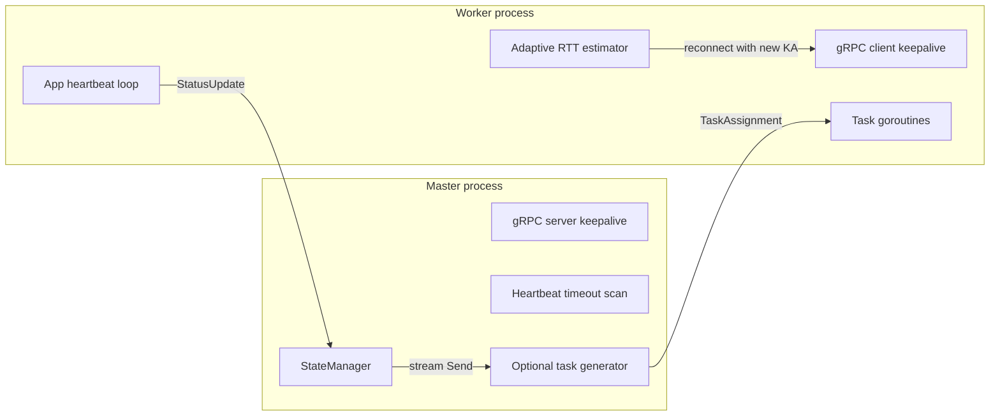

# Design: Adaptive gRPC Keepalive for a Master–Worker Runtime

**Author:** Yilin (Elaine) Zhang  
**Status:** Version 1 (aligned with repository `adaptive-grpc-keepalive`, Go module `github.com/YilinZhang0101/adaptive-grpc-keepalive`)  
**Date:** April 6, 2026

## 1. Overview

This system is a **Go-based master–worker distributed runtime** built on **bidirectional gRPC streaming**. The research and engineering focus is **failure detection under crash versus “silent” failures** (for example, process freeze, severe GC pause, or CPU starvation).

**Core observation:** TCP and transport-level teardown often expose **crash failures** quickly. They do **not** reliably expose **silent failures**, where the connection stays open but the peer stops making progress. Operators then rely on **timeouts**—at the transport (gRPC keepalive), the application (heartbeat messages), or both.

**Core tension:**

- **Aggressive** timeouts → faster detection, but more **false positives** under jitter or host scheduling delay.
- **Conservative** timeouts → fewer false positives, but **slow** detection of freezes.

This project adds an **adaptive keepalive tuner** on the worker, inspired by **RFC 6298** (Jacobson/Karels smoothed RTT and variance), so keepalive intervals and deadlines track recent timing behavior instead of staying fixed.

## Evolution

v0: static timeout  
v1: heartbeat-based detection  
v2: adaptive keepalive (RFC 6298)

## 2. Goals and Non-Goals

### Goals

- Provide a **single long-lived bidi stream** (`Connect`) for registration, heartbeats/status, and task push from master to worker.
- Separate **failure detection paths** in logs and behavior: clean close, receive errors, send errors, and application heartbeat timeout.
- Implement **RFC 6298–style** `SRTT`, `RTTVAR`, and `RTO = SRTT + 4×RTTVAR` to recommend `keepalive` **Time** and **Timeout** on the worker.
- Support **repeatable experiments** via containerized deployment and optional **network emulation** (`tc netem`) for delay/jitter.

### Non-Goals (current codebase)

- **No external task broker** (for example RabbitMQ): tasks are generated inside the optional master task loop or by future producers calling into the scheduler API.
- **No production-grade master HA**: one logical master process is assumed.
- **No rich task DAG / cron / priority queues**: task assignment is a minimal envelope (`task_id`, `task_name`, `payload` bytes); worker execution is a stub sleep for demonstration.

## 3. Architecture

**Components**

| Piece | Role |
|--------|------|
| **`cmd/master`** | gRPC server, `Connect` handler, optional periodic task generator, periodic stats log, heartbeat timeout scanner |
| **`cmd/worker`** | gRPC client, registration, recv loop for assignments, concurrent task slots (`max_concurrency`), periodic status/heartbeat sends, optional adaptive reconnect |
| **`internal/scheduler`** | In-memory **global view**: registered workers, last reported `active_task_count`, aggregated load; worker selection and task send hooks used by the master |
| **`internal/adaptive`** | `RTTEstimator`—RFC 6298 smoothing; `Recommend()` maps estimates to suggested keepalive **Time** / **Timeout** with clamps |
| **`proto/scheduler.proto`** | Messages and `SchedulerService.Connect` stream contract |

## 4. Protocol (`proto/scheduler.proto`)

Workers initiate **one** bidi stream:

- `rpc Connect(stream WorkerMessage) returns (stream MasterMessage);`

**Worker → master**

- First message **must** be `RegisterRequest` (`hostname`, `max_concurrency`) inside `WorkerMessage` with a stable `worker_id`.
- Later messages are `StatusUpdate` (`active_task_count`) for heartbeats and load reporting.

**Master → worker**

- `RegisterResponse` after registration.
- `TaskAssignment` (`task_id`, `task_name`, `task_payload`).

## 5. Connection and Session Lifecycle

### Master (`Connect`)

1. Accept stream; require first message to be registration; register worker with `StateManager` (including the server stream for downstream sends).
2. Send successful `RegisterResponse`.
3. Loop on `Recv()`:
   - `io.EOF` → log `[Detect] ... type=EOF`.
   - Other errors → log `[Detect] ... type=RECV_ERR`.
   - `StatusUpdate` → update worker state (and heartbeat freshness where implemented).
4. `defer` unregister worker on handler exit.

### Worker (`runWorkerSession`)

1. `Dial` master with **client** keepalive parameters (env-tunable).
2. Open `Connect` stream; send `RegisterRequest`.
3. **Recv loop** (goroutine): handle `RegisterResponse` and `TaskAssignment`.
   - Each assignment increments concurrency (semaphore), updates `active_task_count`, sends status on start/finish; demo work is `time.Sleep(3s)`.
   - Stream errors / EOF logged with `[Detect]` on the worker side.
4. **Main loop**: ticker-driven `StatusUpdate` sends (application heartbeat). Failed `Send` → `[Detect] type=SEND_ERR`.
5. If **adaptive** mode is enabled, inter-send timing feeds the estimator; after enough samples and a reconnect interval, session may return **new** keepalive params; outer loop reconnects with updated `grpc.WithKeepaliveParams`.

## 6. Failure Detection Model

The implementation distinguishes paths deliberately:

| Tag | Where observed | Typical cause |
|-----|----------------|---------------|
| **EOF** | Master or worker | Clean stream close |
| **RECV_ERR** | Master (`Recv` error) | Abnormal stream termination on read |
| **ERR** | Worker recv loop | Peer reset / protocol error |
| **SEND_ERR** | Worker | Cannot write status (backpressure, reset, freeze) |
| **HB_TIMEOUT** | Master (scanner) | No fresh status within `MASTER_HB_TIMEOUT` |

**Why this matters:** Crashes often surface as **transport errors** quickly. Freezes may leave TCP **open**; **application heartbeats** plus **keepalive** define how long silence is tolerated before declaring the worker dead.

## 7. Keepalive: Two Layers

### 7.1 gRPC keepalive (transport)

**Master** uses `grpc.KeepaliveParams` and `grpc.KeepaliveEnforcementPolicy` (notably `MinTime` so clients may ping at least every 1s when tuning aggressively).

**Worker** uses `grpc.WithKeepaliveParams` with env defaults (`WORKER_KA_TIME`, `WORKER_KA_TIMEOUT`).

These settings affect **HTTP/2 PING** behavior and help detect **some** dead connections, but are not a substitute for application-level progress signals when the process is alive-but-stuck.

### 7.2 Application heartbeat + master scan

The worker sends `StatusUpdate` on an interval (`WORKER_HEARTBEAT`, default 2s). The master runs `MASTER_HB_SCAN` (default 200ms) and marks workers stale beyond `MASTER_HB_TIMEOUT` (default 6s in code; compose file may override, e.g. 15s).

**Semantics in tests:** `StateManager` may treat a worker as **suspected** after timeout to **deduplicate** repeated timeout logs until a new `StatusUpdate` clears the flag.

## 8. Adaptive Keepalive (`internal/adaptive`)

### 8.1 Estimator

`RTTEstimator` implements RFC 6298-style updates:

- First sample initializes `SRTT` and `RTTVAR`.
- Later samples: update `RTTVAR` with `β`, then `SRTT` with `α` (constants match RFC recommendations).

`RTO()` returns `SRTT + 4×RTTVAR`, clamped to `[1s, 30s]` for keepalive timeout use.

### 8.2 Recommendation mapping

`Recommend()` sets:

- **`KATimeout`** ← `RTO()` (same structural role as retransmission timeout).
- **`KATime`** ← `3×SRTT` (clamped to `[1s, 60s]`), with the invariant **`KATime > KATimeout`** so a ping period does not finish before the prior deadline.

**Sample source in the worker:** elapsed time between **successful** periodic status sends proxies “RTT-like” timing (including scheduling jitter under load—not a pure network RTT). That is intentional: the goal is to tune **how long we wait before concluding silence is failure** under **observed** send pacing.

### 8.3 Applying recommendations

Controlled by `WORKER_ADAPTIVE_ENABLED`, `WORKER_ADAPTIVE_RECONNECT_EVERY`, `WORKER_ADAPTIVE_MIN_SAMPLES`, `WORKER_ADAPTIVE_MIN_DELTA`. Reconfiguration only occurs when the suggested params differ from the current ones by at least `min_delta`, reducing thrash.

## Design Alternatives

### Static Keepalive
- simple
- poor under jitter

### Adaptive Keepalive (this project)
- responsive to environment
- slightly more complex

## 9. Scheduling and Global Load

The **`StateManager`** maintains a **global view**:

- Per worker: `max_concurrency`, `active_task_count` (from status updates).
- **Aggregate:** `GetGlobalLoad()` → sum of active tasks and sum of capacities.

**Worker selection** (used by the optional task generator and covered by unit tests): prefer the worker with **lowest** `active_task_count` subject to spare capacity; errors if no worker is available.

**Optional task generator** (`MASTER_ENABLE_TASKGEN=1`): batches assignments on `MASTER_TASK_TICK` / `MASTER_TASK_BATCH` for stress or demo—**not** a broker-backed pipeline.

**Repository alignment:** `cmd/master` and `internal/scheduler/state_test.go` assume a `StateManager` that also holds **per-worker send streams**, exposes **least-load selection**, **timeout scanning** with deduplication, and **outbound task send**. The minimal `state.go` in the tree implements registration, status updates, and `GetGlobalLoad`; completing the methods and fields expected by the master and tests is required for a clean `go build ./...`.

## 10. Configuration Reference (Environment)

**Master**

| Variable | Purpose |
|----------|---------|
| `MASTER_LISTEN_ADDR` | Listen address (default `:50051`) |
| `MASTER_KA_TIME` / `MASTER_KA_TIMEOUT` | Server keepalive |
| `MASTER_HB_TIMEOUT` / `MASTER_HB_SCAN` | App heartbeat deadline and scan period |
| `MASTER_ENABLE_TASKGEN` | Enable built-in generator (`1`) |
| `MASTER_TASK_TICK` / `MASTER_TASK_BATCH` | Generator timing and batch size |

**Worker**

| Variable | Purpose |
|----------|---------|
| `MASTER_ADDR` | Master dial target |
| `WORKER_KA_TIME` / `WORKER_KA_TIMEOUT` | Initial client keepalive |
| `WORKER_HEARTBEAT` | Status send interval |
| `WORKER_MAX_CONCURRENCY` | Task slots |
| `WORKER_RECONNECT_BACKOFF` | Delay between sessions |
| `WORKER_ADAPTIVE_*` | Adaptive mode, samples, reconnect interval, min delta |

## 11. Deployment and Experiments

- **`docker compose up --build`** builds a two-stage image (Go 1.24 builder, slim runtime with `iproute2` for `tc`).
- **Worker** may run an entrypoint wrapper that applies **`tc netem`** delay/jitter when `DELAY_MS` / `JITTER_MS` are set; `NET_ADMIN` capability is included for that path.
- Defaults in compose slow the task generator for quieter logs vs. binary defaults.

## 12. Testing

- **`internal/adaptive`:** Estimator convergence, bounds on recommendations, initial RTO without samples.
- **`internal/scheduler`:** Least-load `SelectWorker`, heartbeat timeout deduplication, status update clearing suspected state.

## 13. Observed Tradeoffs (from experiments)

Documented in `README.md`: crash-style failures are detected quickly (~100–200 ms in cited runs); **freeze** detection without adaptation can be on the order of many seconds (keepalive + heartbeat stack); adaptive tuning **reduces** freeze detection latency under unstable conditions at the cost of more sensitivity to timing noise (possible false positives if parameters are too aggressive).

## Limitations

- Uses status-send timing as RTT proxy
- Sensitive to CPU scheduling delay
- Requires reconnect to apply new parameters

## 14. Future Work

- Richer **health signals** in `StatusUpdate` (CPU, queue depth, latency percentiles) for scheduling beyond least-load.
- **Broker-integrated** ingest with **macro backpressure** (master as sole consumer) as a separate scale/resilience track—orthogonal to keepalive tuning but compatible with the same master–worker stream.
- **Formal evaluation** harness (replayable traces, CPU pinning, freeze injection) checked into `scripts/` for CI or one-command reproduction.

## 15. Related Documentation

- **README.md** — quick start, detection taxonomy table, example latencies.
- **RFC 6298** — [https://www.rfc-editor.org/rfc/rfc6298](https://www.rfc-editor.org/rfc/rfc6298)
